## 前言

一年又一年，时间过得太快啦！

最近总是想着2022年的点点滴滴，一年时光不得写点什么不一样的，可是思前想后觉得这一年也没什么不一样的啊。所以呢，2022年终总结标题就取名为`平淡无奇`。

**人一生最重要的是什么？**我知乎、百度了一下，给出的答案相似，提到了人生五个方面，分别是**身体健康、财务理财、人际社群、工作事业、家庭生活、学习成长**。自己也觉得挺合理的，于是决定年终总结按这五个方面来写。

写年终总结思想过程中，想到了大学毕业前写的一篇写给五年后自己的话，想跟读者一起回顾下：

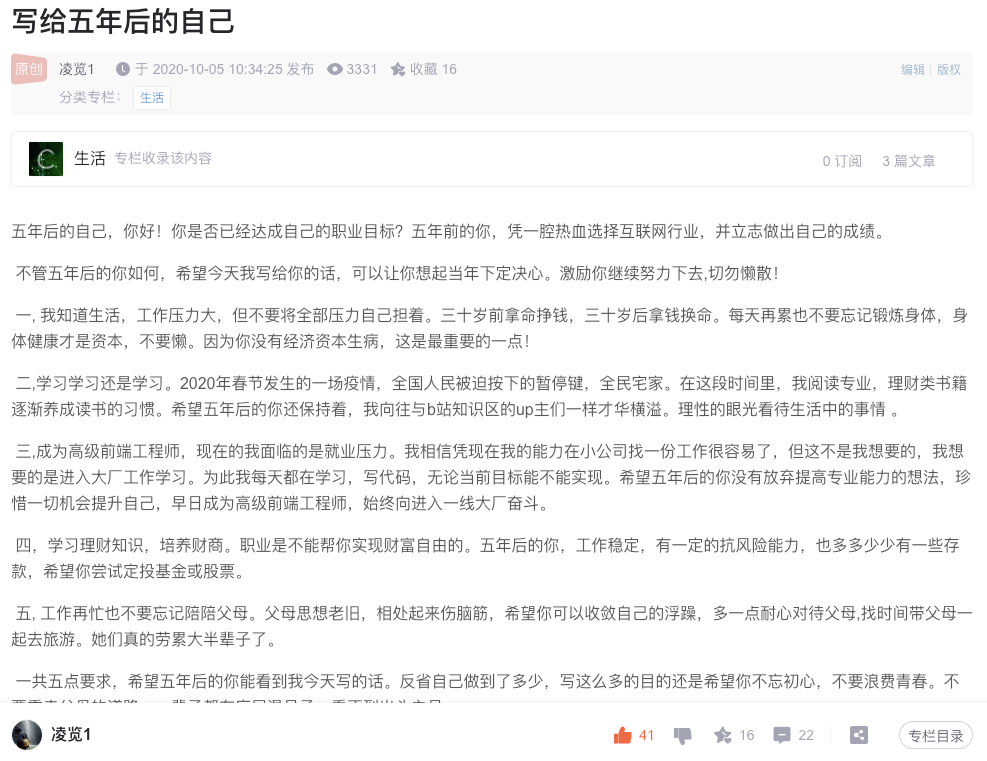

共勉！

## **身体健康**

身体健康是一切的基础，每年我都会下意识地去锻练身体，这一年也不例外。

使用Keep有两年时间，运动总记录有12594分钟，这一年有7480分钟被运动占用

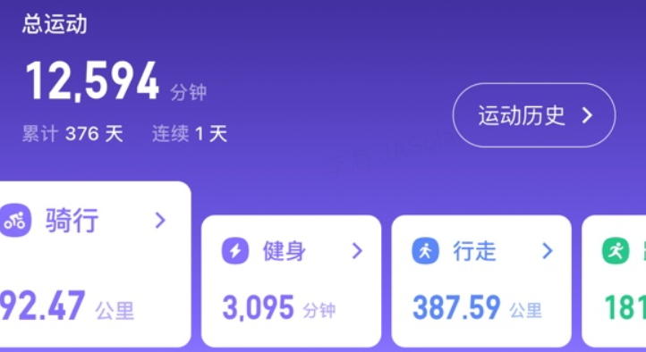

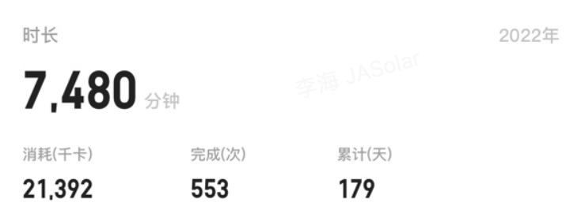

这一年，十一月份买了辆山地车开启周未骑行模式。到写完这篇文章为止，总骑行120公里。

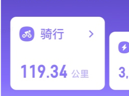

跟大家分享骑行动态：

最长骑行距离刷新到26公里

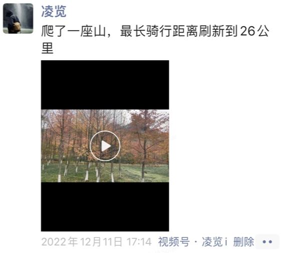

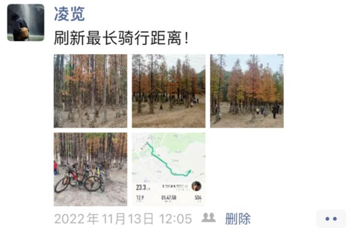

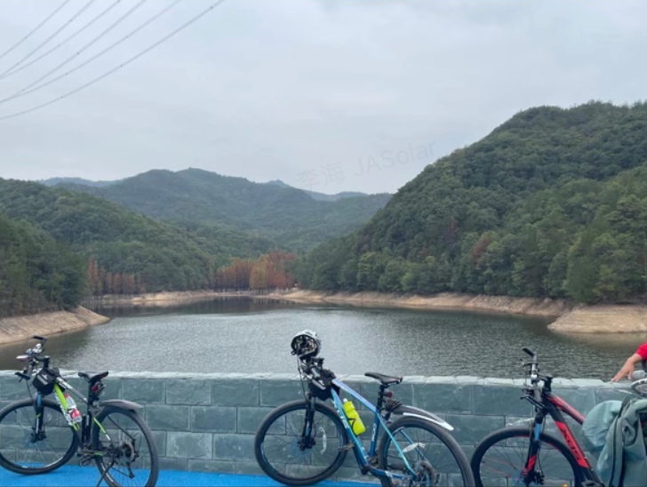

骑行风景照合成视频发表个人视频号

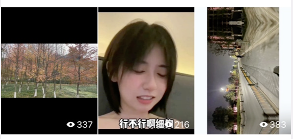

关于运动，我是较真的。

## 财务理财

分享两篇文章：

-   [一个程序员的财务独立之路](https://github.com/ruanyf/weekly/blob/08bcc8c63566fd4750bbeb31415f89ca8f170403/docs/issue-191.md "一个程序员的财务独立之路")
-   [程序员如何实现财富自由 ](https://juejin.cn/post/7142455046599344164 "程序员如何实现财富自由 ")

实现“财务独立”，不再为维持生计和支付日常账单而劳碌。这是每个人都幻想过的，我也想，我的人生目标就是追求财务独立。

读过好几本理财类书籍：

-   《小狗钱钱》
-   《富爸爸穷爸爸》
-   《财富自由之路》等

它们告诉我实现财务独立的一些做法：

-   开源节流

    除工作收入，应扩展更多收入来源，节省生活中不必要的消费；避免高额负债
-   学会投资

    投资自己是最靠谱的；学会钱生钱的方法，股票、基金等可以去购买
-   合理分配收入

    投资不是让你把收入全部碰股市，抱着搏一搏单车变宝马的心态。要将收入分成**要花的钱、保值的钱、生钱的钱以及保命的钱**
-   长期坚持

其实教给我们的道理很简单，难的是自己能否坚持做下去。

这一年，购买了一支股票、一支偏债型基金、二支偏股型基金，给家人及自己购买商业医保有一年。**要花的钱、保值的钱、生钱的钱以及保命的钱**这四笔钱均有去分配，但细想后发觉这四笔钱分配比例有点偏了，后面再调整下。

投资有风险，遭遇损失是常有的。

这一年收益率为-0.12%，学徒级投资吧。

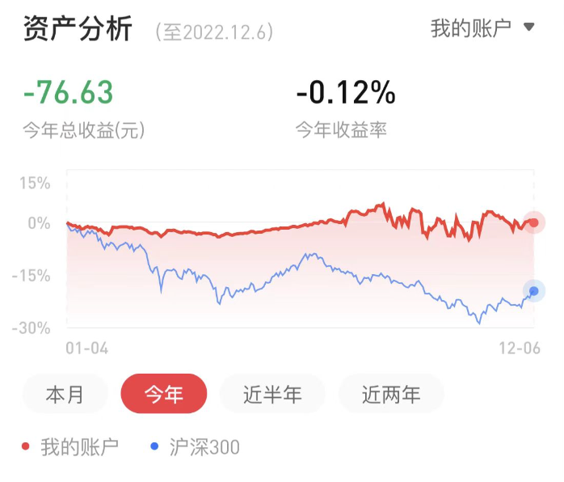

## **人际社群**

人际社交这方面，一直是我不擅长的。大学时期加入过学校社团，呆了半年，后来感觉实在难隔入到群体中就退出了，大学到毕业很少主动去社交，能认识的都是自己班上的。

工作后感觉圈子更窄了，作为技术人大部分时间是在独立思考敲代码，很少有机会能接触认识到优秀的人，更别说跨行业认识优秀的人。

自己线上会加入一些技术群，也会去认识关注一些行内大佬，他们会看书，经常写文档，写规划，写总结，早起学习，产出各种方法论，产出各种技术轮子，并且分享出来。他们有各种各样的优秀特质，我没有，接触后自己的潜意识里面也会想去培养一下特质，见贤思齐，鞭策一下自己。

## 工作事业

我想了想，感觉工作其实没什么好写的，日常工作就是写页面。公司业务技术难点不高，熟悉一段时间后基本可以用搬砖来形容，对于我这种工作没几年的程序员来讲要做的就是积累技能，学习怎么把砖搬好。

然而，在一个地方呆久了之后，难免会进入舒适区，焦虑倒是没感觉到，毕竟自己工作没几年。

温水煮青蛙非常浅显的道理，舒适区呆久了人容易麻木，原地踏步，所以跳出舒适区是下一年自己必须要去做的一件事。

这一年工作带给我的成长有限，重复的工作内容更多的是身体上的劳累，脑袋缺少思考。

最后再放一下公司代码提交记录和个人 `github` 代码提交记录：

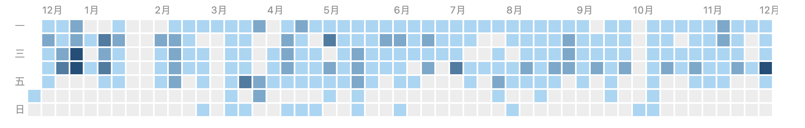

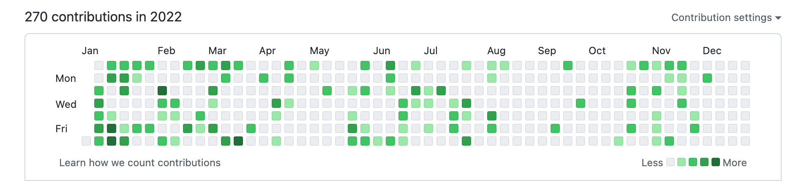

说到事业就更没东西写了，社会阅历尚浅，没钱、没人脉、没点子，没故事，如果去创业肯定是找死。

有时候会想如果这行干不下去了，我会去做什么呢？暂时我也没有找到答案。

生活中会把脑子里一闪而过的想法记录下来，怕突然想不起了，可能哪一天我会从其中找到一条可行性想法做为答案吧。

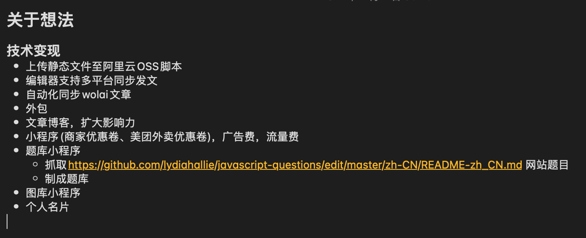

## 学习成长

年初，我定了一个计划：每天学习看书一个小时，然后通过某个应用自动生成，到点提醒

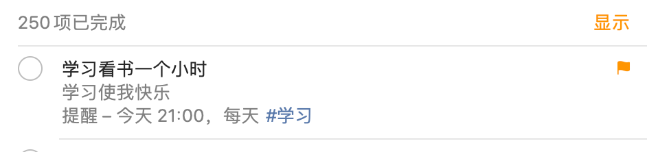

到年尾盘点一下，结果是完成次数少，未完成的次数占大头。

**思想的巨人，行动的矮子**，也许说得就是我这种。

这一年，没完整读完一本书，都是阅读到一半后没再读下去。

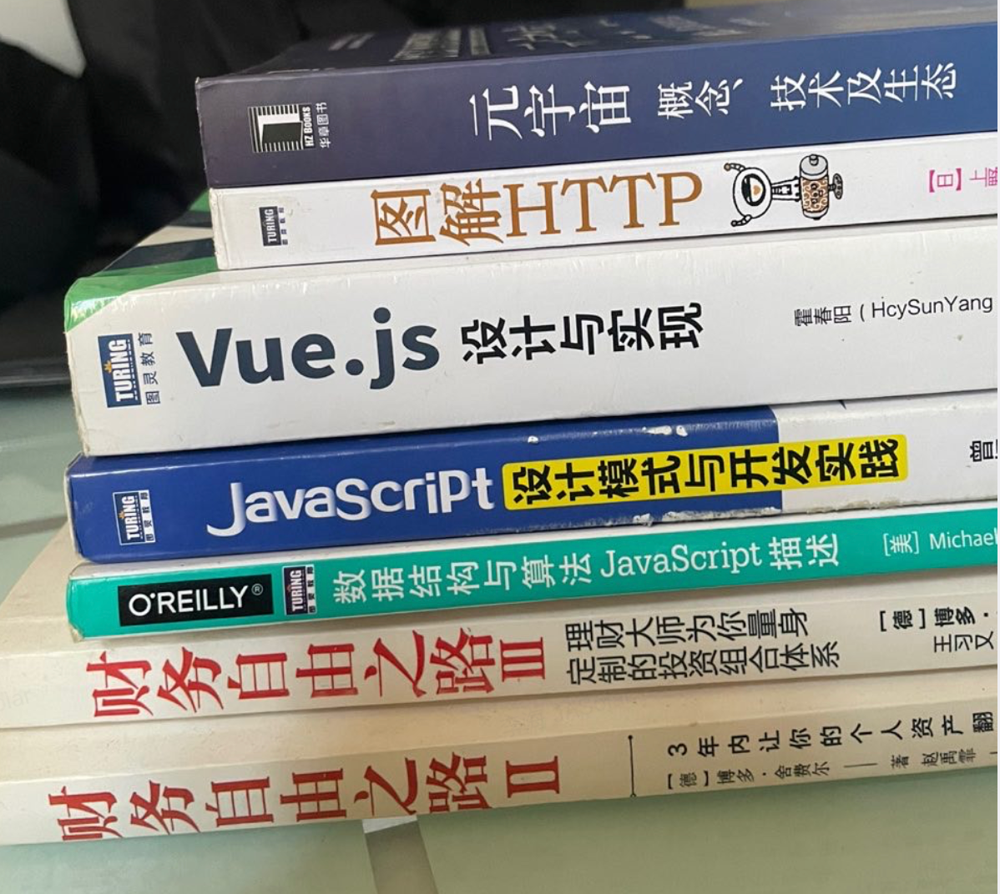

好在自己有写文章的习惯，以教为学，这也是一种高效的学习方法。

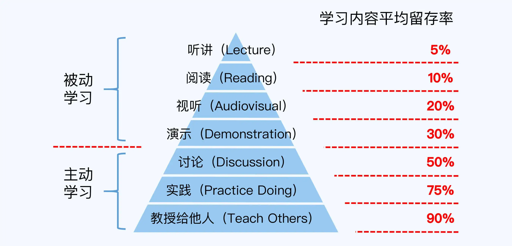

这一年，我在掘金写了10篇文章，写得也比较少，懒人一个。

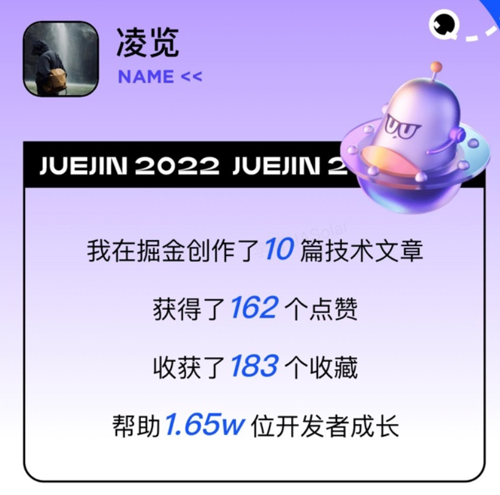

有参与`github`社区贡献，但没有深入参与到某一个开源项目中去

-   [vueuse](https://github.com/vueuse/vueuse/pull/2433 "vueuse")
-   [vue-devui](https://github.com/DevCloudFE/vue-devui/pull/99 "vue-devui")
-   [vant](https://github.com/youzan/vant/pull/9732 "vant")

## 家庭生活

**家家都有本难念的经么？** 有的，我是厌烦了，想离家远点越来越不想回家了。

翻一翻朋友圈，再简单分享一些生活点滴：

自己拍的好看景色

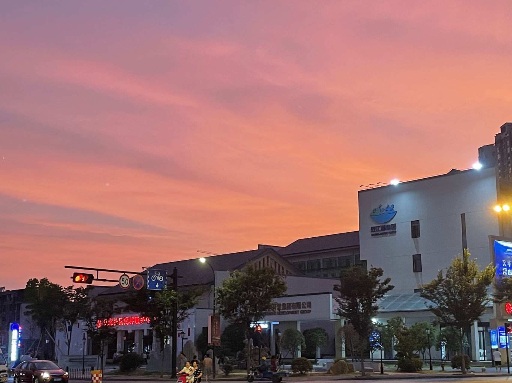

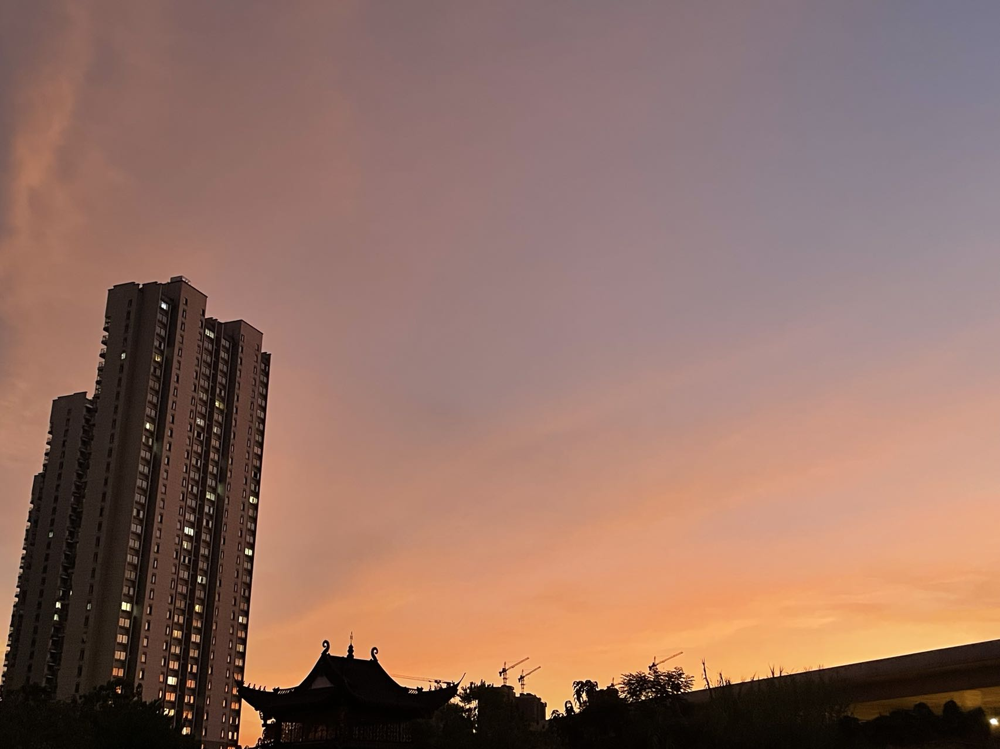

五一假期去横店

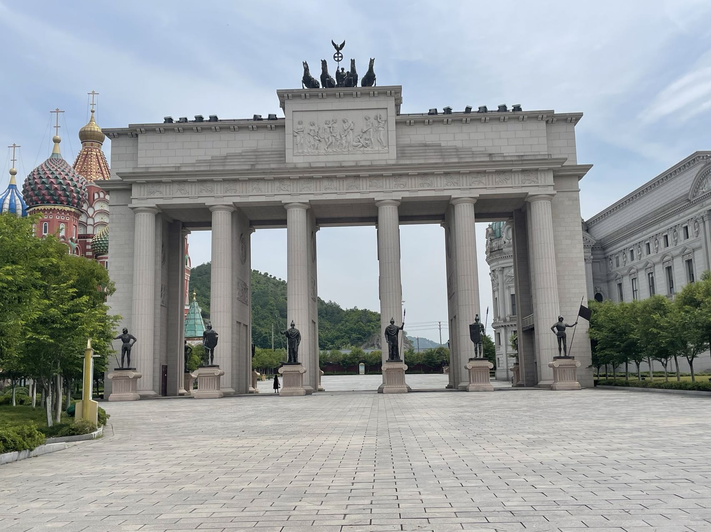

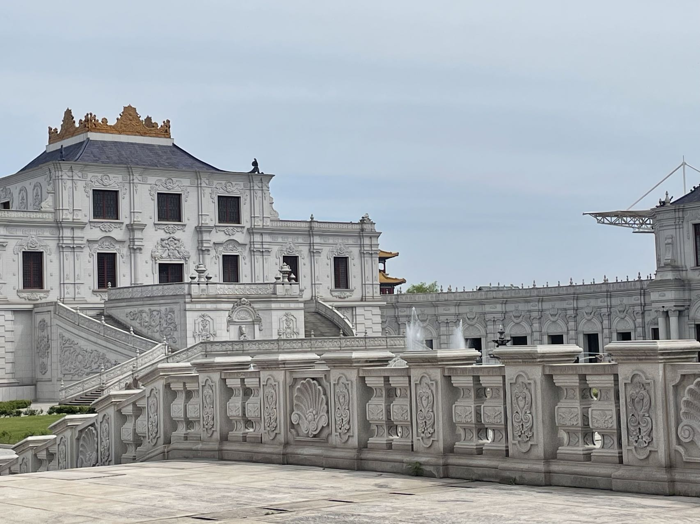

金华衢州、武义游玩

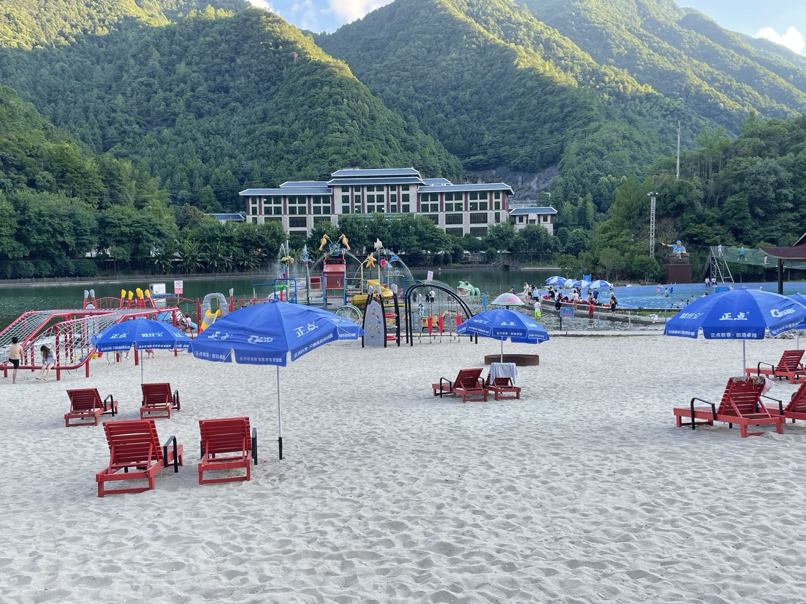

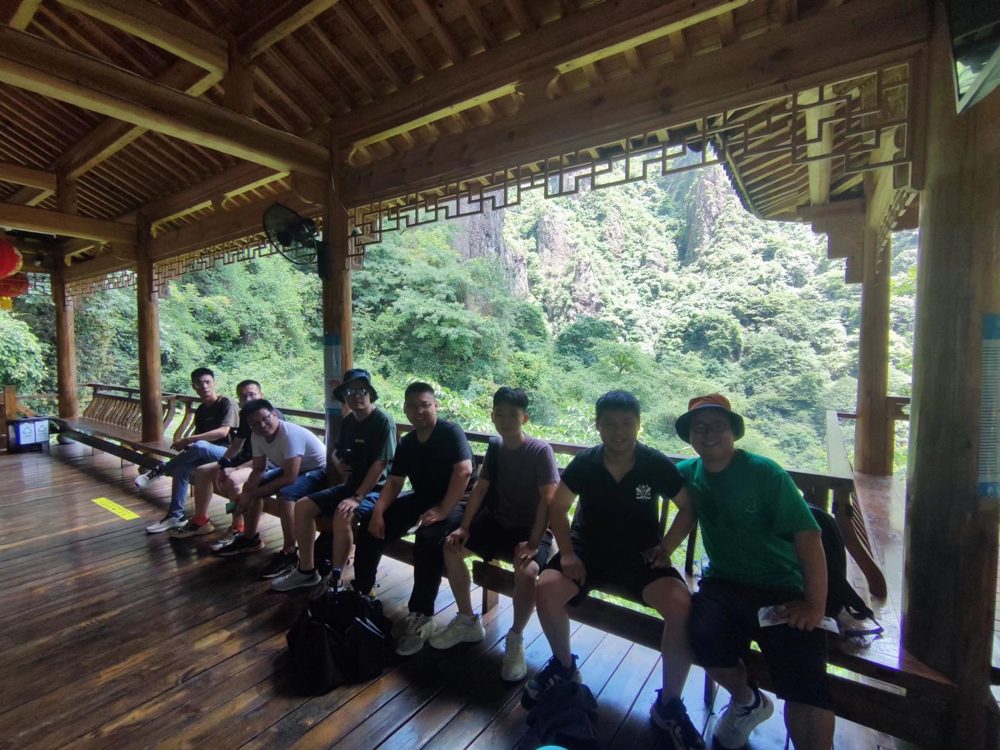

图贴得有点多，不贴了。

## 总结

白驹过隙，日光荏苒，再回看这一年光阴不禁感唉自己没有做成一件让自己满意的事。年中也写一篇总结，flag立的蛮多，完成的没有几件。

2023年度计划简化下就两点：

-   跳出舒适区，多写文章(最少15篇)尝试运营公众号「凌览社」，倒逼自己学习
-   搞钱

最后，2023年，希望大家**在新的一年，遇见更好的自己**。
